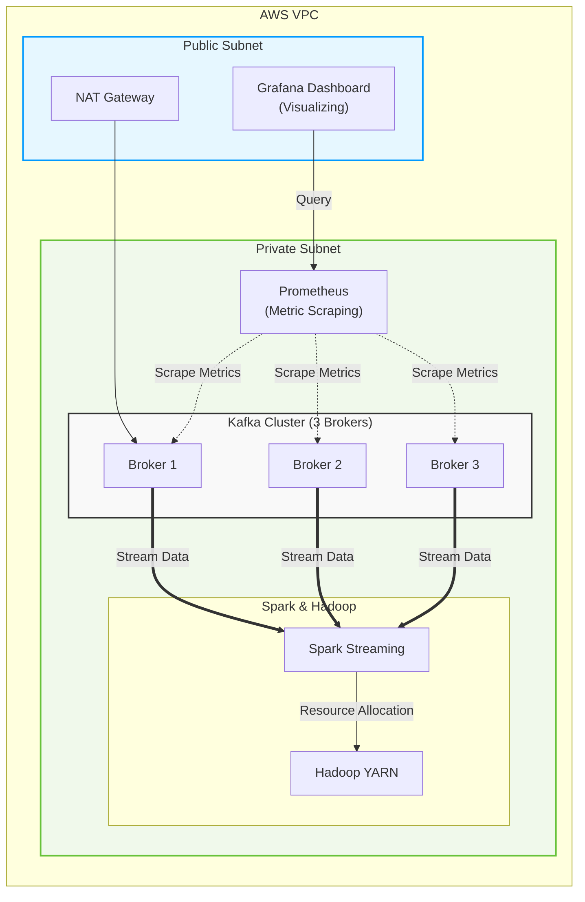
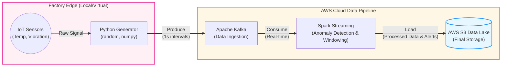

# Baek Seung-woo 👋

  <h3>데이터가 흐르는 길을 설계하는 Data Engineer</h3>
  
단순한 개발을 넘어, 대규모 트래픽과 데이터를 안정적으로 처리하는 <b>클라우드 인프라와 파이프라인 구축</b>에 도전하고 있습니다.  모빌리티 및 스마트팩토리 도메인에서 가치를 창출하는 엔지니어를 목표로 합니다.

 

## 🧑‍💻 About Me
- 🎓 **Education:** 충남대학교 유기재료공학과 학사 (2020.03 ~ 2026.02)
- 💻 **Training:** 삼성청년SW아카데미(SSAFY) 15기 (2026.01 ~ 2026.12 예정)
- 🏭 **Target Domain:** Mobility & Smart Factory 인프라 및 데이터 엔지니어링
- 🌱 **birth:** 2001.12.06 (M)
- 🧠 **MBTI:** INFP
- 📫 **Contact:** `toysw1206@gmail.com`, `+82 010-6632-8709`

 

## 🎯 2026 Goals & Vision
> "이론을 넘어, 직접 인프라를 구축하고 트러블슈팅하며 증명합니다."

1. **Big Data Pipeline Architecture 🌐**
   - AWS EC2 환경 기반의 **Kafka Cluster** 및 **Spark Streaming**을 활용한 실시간 대용량 데이터 파이프라인 구축
   - Prometheus & Grafana를 연동한 시스템 모니터링 및 가용성(HA) 테스트 완수
2. **Backend Deep Dive ☕**
   - 안정적인 데이터 서빙을 위한 **Java** 및 Spring 기반 백엔드 아키텍처 학습
3. **Tech Fundamental 📚**
   - 클라우드 네트워크(VPC, NAT), 분산 처리 시스템, 인프라 자동화(CI/CD) 등 깊이 있는 IT 기초 지식 탐구

 

## Backjoon Tier
  
 
## 🛠️ Tech Stack

  
  
  
  
  
  

 

## 🚀 Current Learning & Project : 실시간 데이터 파이프라인 인프라 구축 기초
> **기간:** 2026.05 ~ 진행 중
> 
> **내용:** 대용량 데이터 처리를 위한 클라우드 및 분산 처리 인프라 기본기 학습

현재 강의를 기반으로 AWS 환경에서 데이터가 흐르는 '물리적인 파이프라인 인프라'를 직접 구축하며 분산 처리 시스템의 원리를 학습하고 있습니다.
- **Cloud Infrastructure:** AWS EC2 환경 기반의 NAT 서버 및 프라이빗 서브넷 네트워크 설계
- **Data Pipeline:** 3대의 Broker로 구성된 **Kafka 클러스터** 연동 및 기초적인 Producer/Consumer 로직 구현
- **Monitoring:** Prometheus & Grafana를 연동하여 실시간 시계열 데이터 파이프라인 상태 모니터링 대시보드 구축
- **Processing (In Progress):** Spark Streaming과 Hadoop YARN을 활용한 클러스터 구성 및 노드 다운 상황을 가정한 가용성(HA) 테스트 진행 중

 

## 🏭 Next Step : 스마트팩토리 가상 데이터 연동 파이프라인 (계획)
> **목표:** 학습한 인프라를 바탕으로 실제 도메인(제조업) 중심의 파이프라인 고도화 및 실증

기초 구축이 완료된 파이프라인 아키텍처 위에, 파이썬(Python) 모듈을 활용하여 가상의 스마트팩토리 센서 데이터 제너레이터를 자체 제작하여 연동할 계획입니다.
- **Data Ingestion:** Python의 `random`, `numpy` 등을 활용해 1초 단위의 가상 IoT 센서 데이터(온도, 진동 등)를 지속 생성하여 Kafka로 전송
- **Stream Processing:** Spark Streaming을 활용한 실시간 윈도우 연산 및 이상 징후(Anomaly Detection) 탐지 로직 적용
- **Storage:** 처리 완료된 최종 가공 데이터를 AWS S3 데이터 레이크(Data Lake)에 적재하여 완벽한 데이터 파이프라인 라이프사이클 완성

 
## 🔍 나의 TIL_Python
[https://](https://github.com/bsw1206/TIL_python)

## 🤝 Git Collaboration Workflow
프로젝트의 안정성과 팀원 간의 원활한 소통을 위해 아래의 엄격한 Git 협업 컨벤션을 준수합니다.

### 📌 Branch Strategy (Git Flow)
- `main` : 배포 가능한 최상위 운영 브랜치
- `develop` : 다음 출시 버전을 개발하는 통합 브랜치 (Default)
- `feature/{기능명}` : 단위 기능 개발 브랜치 (예: `feature/data-crawling`)

### 📌 Pull Request & Merge Rule
- 기능 개발이 완료되면 반드시 `develop` 브랜치로 **Pull Request(PR)** 를 생성합니다.
- 단순한 코드 통합을 넘어, 코드 충돌(Conflict) 해결 과정과 로직에 대해 팀원 간 상호 리뷰를 거친 후 Merge를 진행합니다.

### 📌 Commit Message Convention
직관적이고 추적 가능한 커밋 히스토리를 유지합니다.
- `✨ Feat` : 새로운 기능 추가
- `🐛 Fix` : 버그 수정
- `♻️ Refactor` : 코드 리팩토링 (기능 변경 없음)
- `📝 Docs` : README 및 문서 수정
- `🔧 Chore` : 빌드 업무, 패키지 매니저 설정 수정

 

---

  

